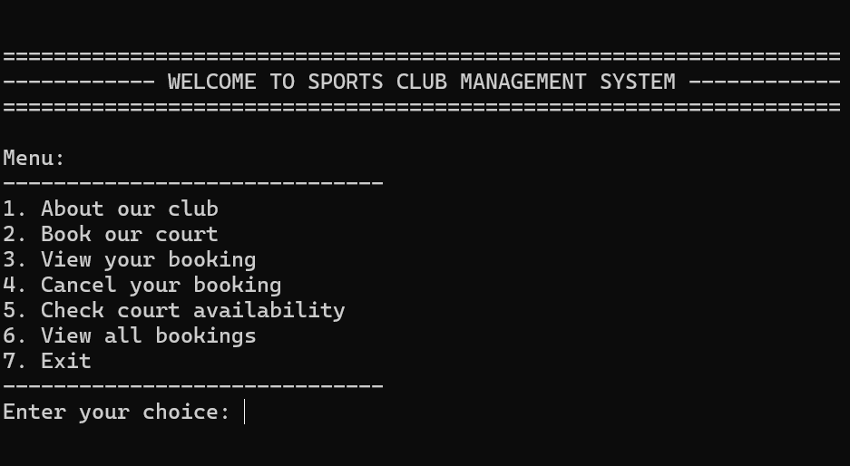
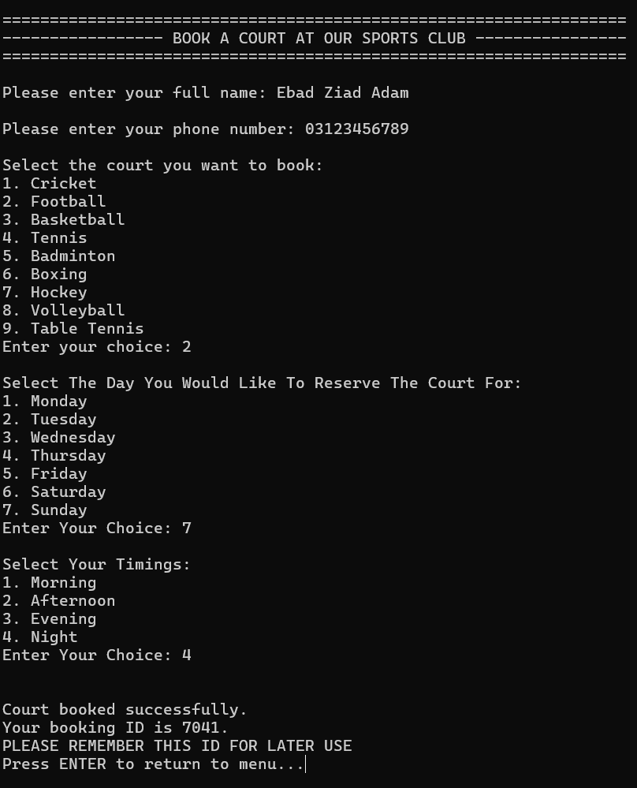
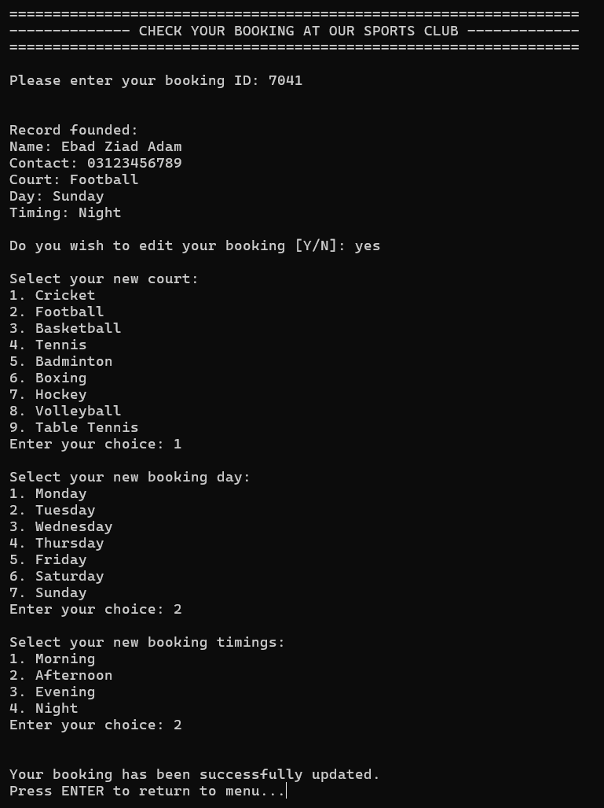
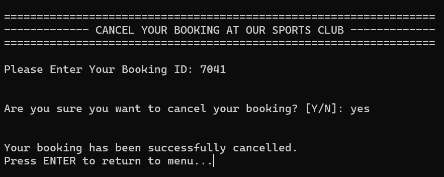
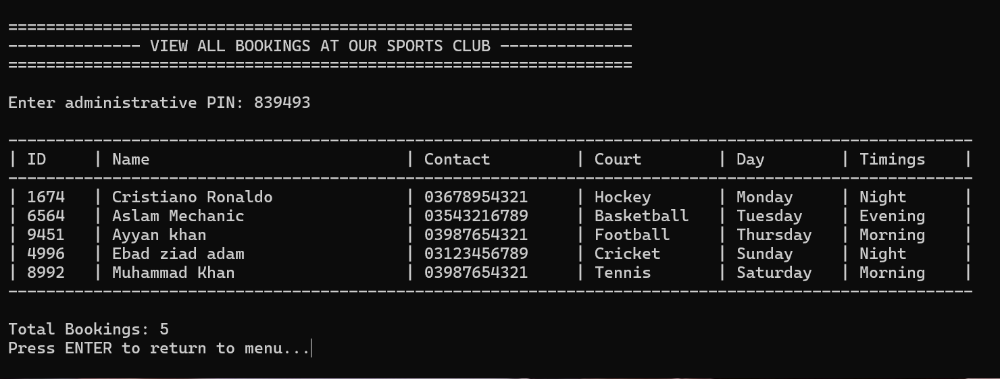

# Sports Club Management System

A robust, console-based application written in C for managing sports facility bookings. This system allows users to reserve courts, manage their schedules, and allows administrators to oversee club operations with persistent data storage.

## Overview

The **Sports Club Management System** is a console-based application developed in **C** that allows a sports club to manage court bookings efficiently. The system enables users to book courts, check availability, view and edit bookings, and cancel reservations. All booking data is stored persistently using file handling.

This project demonstrates the practical application of **data structures, modular programming, and file I/O** concepts taught in introductory Computer Science courses.

Managing sports court reservations manually can lead to conflicts, data loss, and inefficiency. This system automates the booking process by ensuring:
- No double-booking of courts
- Unique booking identification
- Persistent storage of records
- Easy modification and cancellation of bookings

## Key Features

### User Features
* **Book a Court:** Select from 9 different sports (Tennis, Cricket, Football, etc.) with specific day and time slots.
* **Availability Check:** The system automatically checks for time-slot collisions before confirming a booking.
* **Manage Bookings:** Users can search for their booking by ID to view details, **edit** the schedule, or **cancel** the reservation.
* **Unique Booking IDs:** Auto-generated 4-digit unique IDs for every reservation.

### Admin Features
* **Secure Dashboard:** Protected by an administrative PIN (839493).
* **Master View:** View all active bookings in a formatted table.
* **File Persistence:** All data is saved to `booking.txt`, ensuring records are not lost when the program closes.

---

## 📸 Screenshots

### 1. Main Menu

### 2. Booking a Court

### 3. Checking and Editing Booking

### 4. Cancelling Reservation

### 5. Check a Court's Availability

### 6. Administrative View Of All Bookings

---

## Technical Highlights & Programming Principles

This project demonstrates proficiency in low-level memory management and algorithm design.

### 1. Data Structures (Linked Lists)
Instead of using fixed-size arrays, this system uses a **Singly Linked List** to manage bookings.
* **Benefit:** The system can handle an unlimited number of bookings (limited only by system RAM) without recompiling.
* **Implementation:** Dynamic insertion at the head for O(1) efficiency when adding new records.

### 2. Memory Management
* **Dynamic Allocation:** Uses `malloc` to allocate memory only when needed.
* **Leak Prevention:** Implements a strict `free_memory()` function that traverses the linked list and releases all allocated memory upon program exit.

### 3. Input Sanitization & Robustness
* **Modularity:** Each functionality is implemented using seperate functions which helps keeping the code organized and easy to debug.
* **Safety:** Replaces dangerous functions like `gets()` and `scanf()` with `fgets()`.
* **Validation:** Custom helper functions (`get_int_input`, `get_string_input`) ensure the system does not crash if a user enters text instead of numbers.

### 4. File I/O
* **Persistence:** Implements a custom parser to read/write structured data (delimited by `|`) to a text file, allowing the database to survive system restarts.

---
